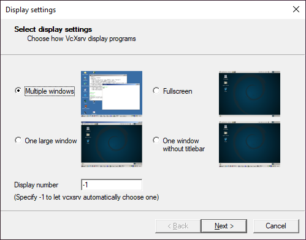
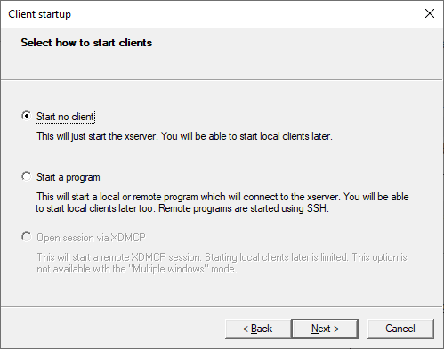
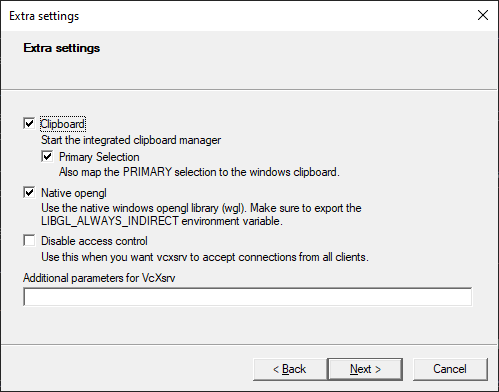
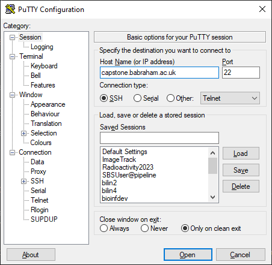
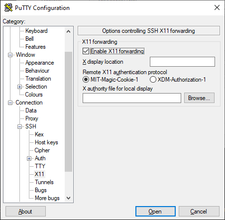
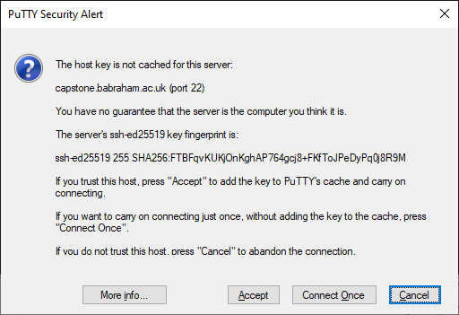
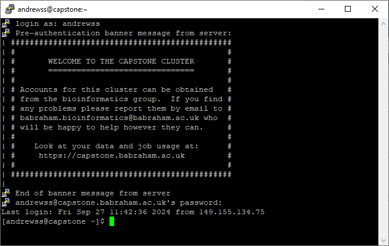

# Connecting to the cluster

## Registering to use the cluster
Before you can use the cluster, you need to be registered as a user on the system. Anyone at the institute can just drop an email to [simon.andrews\@babraham.ac.uk](mailto:simon.andrews\@babraham.ac.uk?subject=Capstone%20Registration) and he will set your account up for you. Everyone at the institute has free access to the cluster.

Anyone from a campus company who wishes to use the cluste can also contact [simon.andrews\@babraham.ac.uk](mailto:simon.andrews\@babraham.ac.uk?subject=Capstone%20Registration) to go through the options for using the cluster and the different levels of access which are available. Access to the cluster for campus companies is not free, and we can go through the costs for different levels of access to work out what would work for you.

## Where can I access the cluster from?

### Babraham Institute Intranet
The cluster is directly visible on the Babraham Institute Intranet, so when you're connected via a network cable on site, or connected on an institute machine to the Eduroam wireless network on site.   Direct access is *not* available from any of the following:

* A non Babraham-instistute machine, even if connected to Eduroam at Babraham
* A Babraham institute machine connected to Eduroam on another site (ie at the university)
* A Babraham institute machine connected to the cloud wireless network

### Off site access
You can connect to the cluster from outside the institute in one of the following ways

* By using the Babraham VPN service on an institute laptop
* By using the RDWeb service from any machine (once you have registered for RDWeb access)
* By using a network which has been specifically permitted to access the cluster (mostly for campus companies)

## Software required to use the cluster
There are two ways you can connect to the cluster

1. A command line SSH connection.  This is the most direct and flexible way to use the cluster. It gives you command line access to the head node and lets you run linux commands directly.
2. A connection to the cluster web interface. The cluster web interface can be used to monitor your cluster use, and also to run certain types of application such as Rstudio sessions or Jupyter labs notebooks. Use of the web interface only requires a web browser.

The software you'll need to connect to the cluster varies depending on what operating system you're using.

### Windows
Windows users will need to install two pieces of software to access the cluster.  To allow a command line connection they should use PuTTY.  For running graphical programs you will need an additional piece of software called VcXsrv Windows X Server. For institute machines, both of these pieces of software are available in the windows software centre.

### OSX
Mac users can connect to the cluster just using the Terminal.app program, which should already be available on your system. If you want to use graphical programs then you will also need to install the XQuartz app.  For institute users this is available in the managed software application.

### Linux
Anyone using Linux as their desktop operating system generally won't need to install anything additional to connect to the cluster as all of the software required will be present already.

## Making a connection (windows)
The instructions here assume that you need to run both command line and graphical programs on the cluster.  If you're just doing command line programs then you can ignore all of the parts relating to VcXsrv.

Before connecting to the head node ensure that the VcXsrv Windows X Server program is running (```Start > All Programs > VcXsrv > XLaunch```).   The window below should pop-up, keep the defaults (as show here) and click ```Next```.  



In the new pop-up window, keep the default ```Start no client``` and then click ```Next```.



And again, when another pop-up window is displayed, keep the defaults (as shown below) and click ```Next```.



Once VcXsrv Windows X Server is running, you can use PuTTY to connect to the cluster.  When you first run PuTTY you will see the main configuration screen.



On the front screen you need to enter the name of the head node in the ```Host``` box, which is ```capstone```.  If you want to run graphical programs then you also need to move to the ```Connection > SSH > X11``` option, and tick the box which says ```Enable X11 forwarding```.



You can now save these settings by putting a name in the ```Saved Sessions``` box on the main screen and then pressing Save.  In future you can then connect to the cluster by simply double clicking on the saved session in the saved session list.

When you start a session you will see a PuTTY screen appear from where you can enter your login details.  The first time you connect to the cluster you will get a warning about the server not being recognised.  If you press ```Accept``` then you should never see this again.



The login details you use will be your normal domain username and password.




## Making a connection (OSX)
To connect to the cluster first start the ```XQuartz``` program from your applications folder. This may open an "xterm" window, but if it does you can close this.

To make an SSH connection open the ```Terminal``` application from your applications folder.  You should see a text window appear.

Once the terminal appears you can connect to the cluster by running:

```ssh -YC capstone.babraham.ac.uk```

…and using your password to connect.


## Making a connection (Linux)
Linux users can connect to the cluster from whichever terminal application they normally use.  The command line would be the same as for OSX.

```ssh -YC capstone.babraham.ac.uk```

If the username you’re using on your local linux session isn’t the same as your cluster username then you can specify a specific user to connect as using

```ssh -YC username@capstone.babraham.ac.uk```
